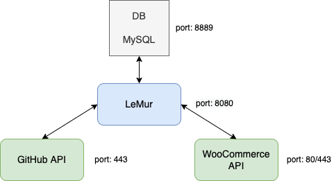
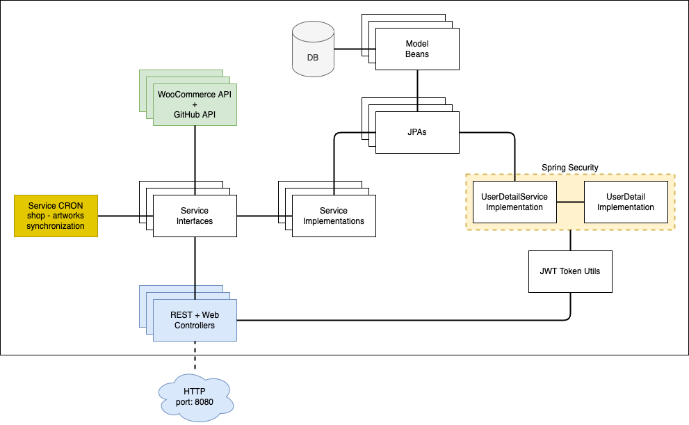

# Le M.U.R. Grenoble

Logiciel d'aide à la gestion d'œuvres artistiques.

## Formation "Développeur d'application JAVA", OpenClassrooms.

	P12 : aider la communauté en tant que développeur d'application Java

## Le projet :

**Le source** 

https://github.com/OMorlotti/P12

**Le site web** 

Ce logiciel open-source propose un système de gestion spécifique aux besoins du bureau de l’association Le M.U.R. proposant :
* Une base de métadonnées d'artistes
* Une base de métadonnées d'œuvres
* Une base de documents (drive)
* Un système de tagage (artistes et œuvres)
* Un système de recherche multi-critères

**Un batch** 

Il assure la synchronisation entre la base d'œuvres et une e-boutique tierce.

## Les contraintes fonctionnelles

* Application basée sur le framework MVC SpringBoot
* Utilisation des API web
    * WooCommerce  pour la synchronisation oeuvres/e-boutique
    * GitHub pour le versionning des documents
* Packaging avec Maven
* Déploiement avec Docker

## Développement

Cette application a été développée avec :
* Intellij IDEA
* Java 12
* Tomcat 9
* MySQL 8
* Spring Boot 2.7.0
* Pebble 3.1.5

L'application a été développée suivant une architecture à microservices :

La partie WebAPI étant développé avec Spring Boot et Spring Security :

## Déploiement

Via docker avec le fichier `Dockerfile` à la racine du projet :

Variables d'environnement :
* `DB_URL` : `jdbc:mysql://<mysql ip>:8889/le_mur?useSSL=false&serverTimezone=UTC`
* `DB_USERNAME` : DB username
* `DB_PASSWORD` : DB password
* `WC_URL` : `http://<woocommerce ip>:8888/wp-json/wc/v3/`
* `JWT_SECRET` : JWT secret
* `JWT_EXPIRATION_MS` : 86400000

Port : 8080

Dans votre navigateur, accédez au site à l'adresse [http://localhost:8080](http://localhost:8080).

## Auteur

Olivier Morlotti
